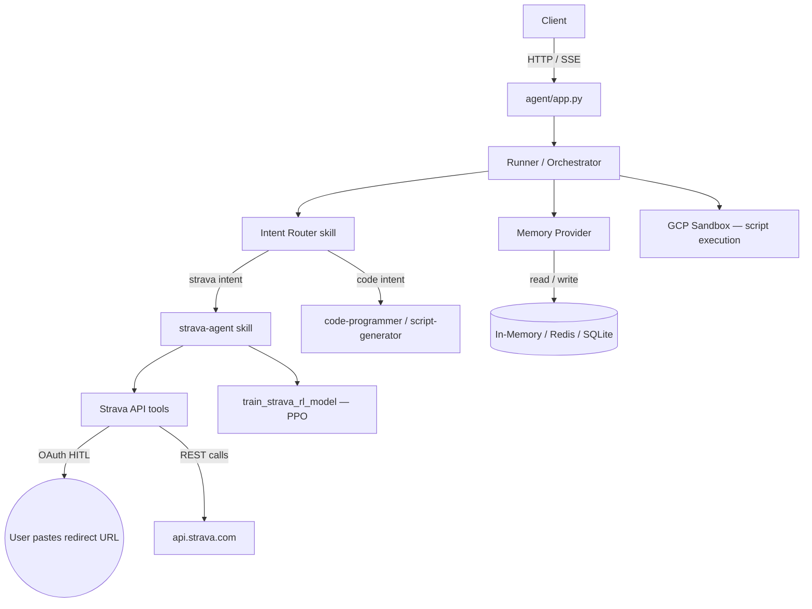

# Strava Agent — Backend

A conversational AI backend that lets you interact with your Strava data through natural language. Built on top of [Google ADK](https://github.com/google/adk-python), it exposes the full Strava API as agent-callable tools with OAuth HITL flow, token management, and an optional cycling RL training pipeline.

## Features

- **Full Strava API coverage** — athlete profile, activities, segments, clubs, routes, gear, uploads, streams, and GPX/TCX export.
- **OAuth with Human-in-the-Loop** — guided OAuth2 flow: the agent generates the authorization URL, the user pastes the redirect URL, and the agent exchanges it for tokens automatically.
- **Token refresh & rotation** — automatic `refresh_token` rotation on every refresh cycle.
- **Cycling RL training** — optional PPO-based reinforcement learning model trained on real Strava activity data (`train_strava_rl_model`).
- **Modular skills architecture** — each capability lives in its own skill under `agent/skills/`, making it easy to extend.
- **Pluggable memory providers** — in-memory, Redis, SQLite, and OpenAI-backed vector store for conversation context.
- **Multi-LLM support** — Google Gemini (Vertex AI or API key), OpenAI, and any LiteLLM-compatible provider.
- **GCP-ready** — includes `Dockerfile` and `cloudbuild.yaml` for Cloud Run deployments.

## Architecture



## Project Structure

```
app.py                      # Top-level entrypoint (local dev)
agent/
  app.py                    # FastAPI application & /ask endpoint
  runner.py                 # Agent runner logic
  config/config.py          # LLM provider setup, skill loading
  skills/
    strava-agent/           # Core Strava skill (SKILL.md + swagger.json)
    orchestrator/           # Multi-skill orchestration
    intent-router/          # Routes user intent to the right skill
    code-programmer/        # Code generation skill
    script-generator/       # Script generation skill
    script-execution/       # Script execution skill
    answer-agent/           # General Q&A skill
    memory-agent/           # Memory read/write skill
  tools/
    strava/                 # Strava OAuth + API tool wrappers
    memory/                 # Memory factory, interface, providers
    sandbox/                # GCP sandbox & script execution tools
    vectors/                # Vector store providers
```

## Getting Started

### Prerequisites

- Python 3.10+
- A Strava API application (get `client_id` and `client_secret` at [strava.com/settings/api](https://www.strava.com/settings/api))
- Google Cloud project with Vertex AI enabled **or** a `GOOGLE_API_KEY` / `OPENAI_API_KEY`

### Install dependencies

```bash
pip install -r requirements.txt
```

### Environment variables

Create a `.env` file at the project root:

```env
# LLM provider — e.g. "google/gemini-2.5-flash" or "openai/gpt-4o"
LLM_PROVIDER=google/gemini-2.5-flash

# Google / Vertex AI
GOOGLE_API_KEY=...
GOOGLE_CLOUD_PROJECT=your-gcp-project
GOOGLE_CLOUD_LOCATION=us-central1

# Strava (optional — the agent can also ask the user)
STRAVA_CLIENT_ID=...
STRAVA_CLIENT_SECRET=...

# Memory provider: inmemory | redis | sqlite
MEMORY_PROVIDER=inmemory
REDIS_URL=redis://localhost:6379
SQLITE_MEMORY_DB_PATH=memory.db
```

### Run locally

```bash
python app.py
```

The server starts on `http://localhost:8000`. Send requests to `POST /ask` with a JSON body:

```json
{
  "message": "Show me my last 5 Strava activities",
  "session_id": "my-session"
}
```

### Deploy to Cloud Run

```bash
gcloud beta builds submit
```

The included `cloudbuild.yaml` and `Dockerfile` handle the build and deployment.

## Strava OAuth Flow

1. Ask the agent to connect your Strava account.
2. The agent calls `start_strava_oauth` and returns an authorization URL.
3. Open the URL in your browser and approve the permissions.
4. Paste the full redirect URL back into the chat.
5. The agent calls `complete_strava_oauth`, exchanges the code for tokens, and is ready to use the API.

Token refresh happens automatically via `refresh_strava_access_token`. The new `refresh_token` is always reported so you can persist it.

## Configuration

All runtime settings are in `agent/config/config.py`. Memory providers include:

- `inmemory` — fast ephemeral store for local development
- `redis_provider` - requires Redis server
- `sqlite_provider` - file-based local DB
- `openai_provider` - wraps OpenAI for embedding/semantic memory

For Strava OAuth, define these variables in your `.env` file so the agent can authenticate without asking for credentials in chat:

```env
STRAVA_CLIENT_ID=your_strava_client_id
STRAVA_CLIENT_SECRET=your_strava_client_secret
```

## How to Add a Skill

1. Create a new folder under `skills/your-skill-name/`.
2. Add a `SKILL.md` explaining the purpose, sample prompts, and inputs/outputs.
3. Implement the skill integration with the runner/orchestrator if the skill needs custom routing.
4. Use existing tools in `tools/` for script execution, memory access, and sandboxing.

## Memory & Data Flow

- Memory is accessed through a uniform `memory` interface.
- Skills request and persist conversational context using the selected provider.
- For long-term memory and vector-based retrieval, embeddings can be stored via the `openai_provider` or other embedding service.

## Development Notes

- Keep skills stateless where possible; persist session state in memory providers.
- Tools should be idempotent and sandboxed when executing user-provided scripts.
- Add unit tests for new memory-related behavior under `tests/`.

## Contributing

- Fork the repository and open a pull request with a clear description of changes.
- Add or update tests for new features or bug fixes.
- Update relevant `SKILL.md` or documentation files for new/changed skills.

## Next Steps & Suggestions

- Add CI (GitHub Actions) to run `pytest` and linting on PRs.
- Add example conversation flows and Postman/HTTP examples.
- Add usage badges and a short demo GIF to the README.

## License

This project uses MIT License. Update as required for your organization.

## Contact

For questions or clarifications, open an issue in this repository.
