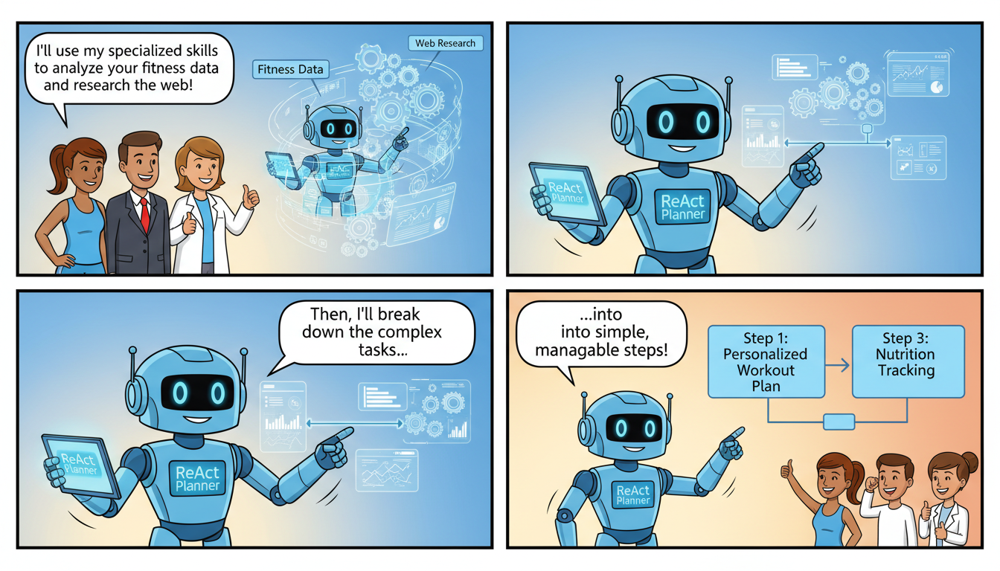

# Auto-ADK Agent: Memory + Code-Generation

[](https://www.python.org/downloads/)
[](https://opensource.org/licenses/MIT)
[](https://cloud.google.com/)

**Auto-ADK Agent** is a sophisticated AI agent framework designed for seamless data integration, autonomous research, and complex task execution. By combining a **Skill-based architecture** with **Code-Generation** and **Memory**, this agent can ingest fitness data from Strava, perform deep research via Wikipedia, and route intents using advanced planning strategies.

---

## 🚀 Key Features

-   **Multi-Agent Orchestration**: Specialized agents for Wiki research, Strava data ingestion, and general query handling.
-   **Skill System**: Modular "Skills" including `intent-router`, `plan-react-planner`, and `query-agent`.
-   **Strava SDK**: Built-in OAuth2 flow and client for interacting with the Strava API.
-   **Memory & Vector Search**: Utilizes vector indices for Wikipedia-based research and context retrieval.
-   **Cloud Native**: Fully integrated with Google Cloud Platform (Secret Manager, Cloud Build) and Dockerized for easy deployment.

---

## 📁 Repository Structure

```text
├── agent/
│   ├── agents/          # Specialized agent implementations (e.g., Wiki Research)
│   ├── skills/          # Core capabilities (Intent routing, Planning, Strava Ingestion)
│   ├── tools/           # Pipeline tools (Wiki LLM, Vector Index, Storage backends)
│   ├── models/          # Domain-specific models (Strava RL)
│   └── config/          # Environment and configuration management
├── strava_agent_sdk/    # Dedicated SDK for Strava integration
├── Dockerfile           # Containerization setup
├── cloudbuild.yaml      # GCP CI/CD configuration
└── pyproject.toml       # Python dependencies and metadata
```

---

## 🛠 Prerequisites

-   **Python 3.13+**
-   **Google Cloud Project**: With Secret Manager API enabled.
-   **Strava API Credentials**: Client ID and Secret from the [Strava Developer Portal](https://www.strava.com/settings/api).

---

## ⚙️ Installation

1.  **Clone the repository**:
    ```bash
    git clone https://github.com/your-repo/auto-adk-agent.git
    cd auto-adk-agent
    ```

2.  **Install dependencies**:
    ```bash
    pip install -r requirements.txt
    ```

3.  **Configure Environment**:
    Create a `.env` file in the root directory:
    ```dotenv
    STRAVA_CLIENT_ID=your_client_id
    STRAVA_CLIENT_SECRET=your_client_secret
    STRAVA_OAUTH_STATE_SECRET=your_random_string
    STRAVA_ALLOWED_REDIRECT_URIS=https://your-app.com/auth/strava/callback
    GCP_PROJECT_ID=your_project_id
    ```

---

## 📖 Usage

### 1. Authenticating with Strava

The agent uses a streamlined OAuth flow to access athlete data. You can use the `StravaAgentClient` to handle the handshake:

```python
import asyncio
from strava_agent_sdk import StravaAgentClient

async def auth_flow():
    client = StravaAgentClient(
        gcp_project_id="your-gcp-id",
        gcp_credentials_path="./credentials.json"
    )

    # Start OAuth Flow
    auth_data = await client.start_strava_oauth(
        redirect_uri="https://miapp.com/auth/strava/callback",
        scope="read,activity:read_all,profile:read_all"
    )
    
    print(f"Go to: {auth_data['auth_url']}")
    
    # After redirect, exchange code for tokens
    code = input("Enter code from URL: ")
    tokens = await client.exchange_strava_code(
        code=code,
        state=auth_data["state"],
        redirect_uri="https://miapp.com/auth/strava/callback"
    )
    print("Authenticated successfully!")

asyncio.run(auth_flow())
```

### 2. Running the Agent (Wiki Research Example)

The agent can perform autonomous research using the `wiki_research_chat_agent.py`:

```python
from agent.agents.wiki_research_chat_agent import WikiResearchAgent

agent = WikiResearchAgent()
response = agent.run("Explain the impact of zone 2 training on cardiovascular health.")
print(response)
```

---

## 🧩 Skills & Pipelines

The agent's intelligence is divided into **Skills**:

-   **`intent-router`**: Determines if a user wants to check Strava stats, search the web, or perform general chat.
-   **`plan-react-planner`**: Breaks down complex queries into executable steps.
-   **`strava-ingestion-agent`**: Handles the ETL process of pulling data from Strava into the agent's memory.
-   **`wiki_vector_index`**: Manages the local vector storage for fast retrieval of research data.

---

## 🐳 Deployment

**Docker**:
Build and run the containerized agent:
```bash
docker build -t auto-adk-agent .
docker run --env-file .env auto-adk-agent
```

**Google Cloud Build**:
The repository includes a `cloudbuild.yaml` for automated deployment to GCP:
```bash
gcloud builds submit --config cloudbuild.yaml .
```

---

## 🛠 Development

### Adding a New Skill
1. Create a new directory in `agent/skills/your-skill-name/`.
2. Define a `SKILL.md` documenting its purpose.
3. Implement the logic and register it in `agent/app.py`.

### Running Tests
*(Note: Ensure you have your test environment variables set)*
```bash
pytest tests/
```

---

## 📄 License

This project is licensed under the MIT License - see the [LICENSE](LICENSE) file for details.

---

*Developed with ❤️ for the athletic and AI community.*